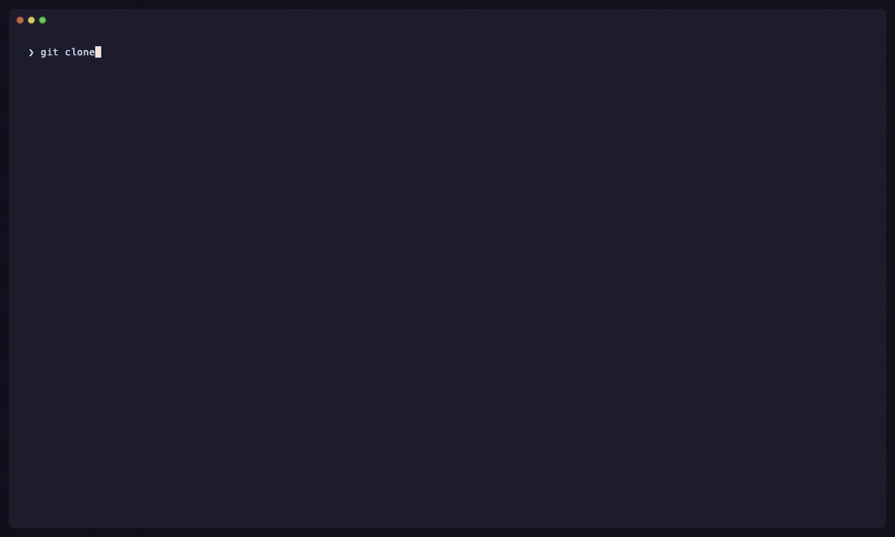

# lamet-agent

<p align="center">
  
</p>

`lamet-agent` is a Python-first framework for reproducible **La**rge **M**omentum **E**ffective **T**heory (LaMET) and lattice QCD
analysis workflows.

## Quick Start

Requires a logged-in Codex CLI on this machine. Codex does not use
`--api-key-file`.

```bash
git clone https://github.com/Greyyy-HJC/lamet-agent.git && cd lamet-agent
python3 -m venv .venv && source .venv/bin/activate
python3 -m pip install --upgrade pip && python3 -m pip install -e ".[codex]"
wget --user=download --password=protonpdf -r -np -nH --no-check-certificate \
  https://149.28.115.134:43999/data_pion_pdf_cg.zip && unzip data_pion_pdf_cg.zip
lamet-agent run examples/pion_pdf_cg_manifest.json \
  --provider codex --model gpt-5.6-luna
```

To compare the run against the reference result:

```bash
cd runs/pion_pdf_cg/ && wget --user=download --password=protonpdf -r -np -nH --no-check-certificate \
  https://149.28.115.134:43999/plot_pion_pdf_compare.py && python plot_pion_pdf_compare.py
```

The archive unpacks to `data_pion_pdf_cg/` at the repository root. The same
files can be downloaded in a browser at
[https://149.28.115.134:43999](https://149.28.115.134:43999) with user
`download` and password `protonpdf`. The server has no trusted certificate:
`wget` uses `--no-check-certificate`, and a browser must trust the self-signed
certificate.

Alternatively with uv:

```bash
uv venv && source .venv/bin/activate
uv pip install -e ".[codex]"
```

### Other providers

API providers (`openai`, `anthropic`, `gemini`, `grok`, `deepseek`, or a custom
HTTP(S) OpenAI-compatible URL) need `python3 -m pip install -e .` (no `[codex]`
extra) and a key via `--api-key-file` or the provider's environment variable.
See [Providers and models](#providers-and-models) for details.

```bash
lamet-agent run examples/pion_pdf_cg_manifest.json \
  --provider openai --model gpt-5.6-luna \
  --api-key-file api.key
```

### Example manifests

| Manifest                                     | Workflow                                                       | Data reference |
| -------------------------------------------- | -------------------------------------------------------------- | -------------- |
| `examples/pion_pdf_cg_manifest.json`         | Coulomb-gauge pion PDF, least-squares correlator analysis.     | [^1]           |
| `examples/pion_pdf_cg_lanczos_manifest.json` | Coulomb-gauge pion PDF with nested-bootstrap Lanczos analysis. | [^1]           |
| `examples/pion_pdf_gi_manifest.json`         | Gauge-invariant pion PDF.                                      | [^1]           |
| `examples/pion_da_gi_manifest.json`          | Gauge-invariant pion DA with systematic variants.              | [^2]           |
| `examples/kaon_da_gi_manifest.json`          | Gauge-invariant kaon DA with systematic variants.              | [^2]           |

Other example archives are on the same host; pick the zip that matches the
`data_*` directory used by that manifest (`data_pion_pdf_cg`,
`data_pion_pdf_gi`, `data_pion_da_gi`, `data_kaon_da_gi`).

[^1]: Xiang Gao, Wei-Yang Liu, and Yong Zhao, [*Parton Distributions from Boosted Fields in the Coulomb Gauge*](https://arxiv.org/pdf/2306.14960), arXiv:2306.14960.
[^2]: Jun Hua et al., [*Pion and Kaon Distribution Amplitudes from Lattice QCD*](https://arxiv.org/pdf/2201.09173), arXiv:2201.09173.

## Command Line

`lamet-agent` and `python -m lamet_agent` expose the same interface:

```text
lamet-agent {validate,plan,run} ...
```

### Validate

```bash
lamet-agent validate MANIFEST
```

Validate reads JSON or JSONC and performs no LLM communication. It checks the
manifest envelope, stage contracts, systematics declarations, job DAG, paths,
correlator descriptors, and kernel parameters.

### Plan

```bash
lamet-agent plan MANIFEST \
  --provider PROVIDER \
  [--model MODEL] \
  [--api-key-file FILE] \
  [--output FILE | --in-place]
```

Plan completes an incomplete manifest through an interactive LLM conversation.
It validates proposed changes and presents a final natural-language summary for
explicit user confirmation.

Options:

- `--provider`: registered provider name or an HTTP(S) OpenAI-compatible URL;
- `--model`: provider model override;
- `--api-key-file`: text file containing only the API key;
- `--output`: output path, defaulting to `<manifest>.planned.json`;
- `--in-place`: overwrite the source after explicit acceptance.

`--output` and `--in-place` are mutually exclusive. A planned output must remain
beside its source manifest so relative input paths preserve their meaning.

Terminal controls include `/show`, `/issues`, `/undo`, `/edit`, `/save`,
`/help`, and `/quit`. `Enter` submits, `Shift+Enter` inserts a newline, and
`Ctrl+C` cancels.

Standalone Plan writes the accepted manifest and exits without running analysis
stages.

### Run

```bash
lamet-agent run MANIFEST \
  --provider PROVIDER \
  [--model MODEL] \
  [--api-key-file FILE] \
  [--progress {auto,stage,job,none}]
```

Run validates before executing numerical stages. If validation fails, it enters
Plan with the selected provider. After the user accepts a valid repaired
manifest, numerical execution continues automatically.

The default progress mode is `auto`:

- `auto`: stage-level job progress when systematics are declared; otherwise
  progress is owned by each numerical job;
- `stage`: one job counter for each stage;
- `job`: stage-specific numerical progress;
- `none`: disable progress bars.

### Providers and models

#### Codex CLI

The `codex` provider uses the optional `openai-codex` package and the cached
Codex login on the current machine. It does not use an API key. `--model` is
optional and overrides the Codex SDK default.

#### OpenAI-compatible APIs

The registered API providers are `openai`, `anthropic`, `gemini`, `grok`, and
`deepseek`. Each reads its API key from `--api-key-file` or the corresponding
environment variable:

| Provider  | Environment variable |
| --------- | -------------------- |
| OpenAI    | `OPENAI_API_KEY`     |
| Anthropic | `ANTHROPIC_API_KEY`  |
| Gemini    | `GEMINI_API_KEY`     |
| Grok      | `GROK_API_KEY`       |
| DeepSeek  | `DEEPSEEK_API_KEY`   |

Registered API providers have a default model; `--model` overrides it. An
HTTP(S) OpenAI-compatible base URL can also be passed directly as the provider.
A non-local custom URL requires `--model`; a local URL may omit it when its
`/models` endpoint returns exactly one model id.

## Core Idea

The manifest contains run metadata and an ordered mapping of stage job lists.
Job ids form a DAG: correlator jobs select raw records, and later jobs consume
earlier outputs through role-named inputs such as `target`, `denominator`,
`input`, and `quasi`.

Expected agent behavior:

- Validate the complete authored workflow before numerical execution.
- Run numerical stages deterministically once their parameters are known.
- Consult the LLM only when a workflow needs fit or range recommendations.
- Write intermediate NetCDF data, diagnostics, plots, and stage reports so the
  complete analysis path remains inspectable.
- Base the final Review on numerical evidence, consistency checks, and selected
  literature.

Implemented stage families, normally authored in this order, are:

1. `correlator_analysis`
2. `renormalization`
3. `fourier_transform`
4. `perturbative_matching`
5. `extrapolation`
6. `review`

A partial workflow may omit unneeded stages. The order of keys under `stages`
is the execution order; there is no separate `metadata.stages` list.

Architecture, file ownership, and contributor workflows are documented in
[`DEVELOPMENT.md`](DEVELOPMENT.md).

## Intermediate Data (NetCDF)

Stage-to-stage numerical artifacts are stored as NetCDF files. Every array has:

- a leading `resample` dimension;
- a sampling mode: `raw`, `jackknife`, `bootstrap`, or `gvar`;
- physical dimensions and coordinates such as `t`, `tsep`, `tau`, `z`, `x`,
  `a`, or momentum;
- ensemble and stage provenance stored as attributes.

A job may also use an external `{ "file": ".../output.nc" }` artifact as its
input.

Typical per-job files are:

| File                  | Purpose                                               |
| --------------------- | ----------------------------------------------------- |
| `output.nc`           | Primary sample-bearing numerical result.              |
| `summary.json`        | Decisions, diagnostics, and declared artifacts.       |
| `llm_transcript.md`   | Recorded LLM requests and responses, when applicable. |
| `diagnostics/*`       | Candidate tables and numerical diagnostics.           |
| `plots/*`             | PDF/SVG result and fit-quality figures.               |

Stage directories also receive an aggregate `report.md`; job directories do not
write report files. Review writes its final `review.md`, `review_bundle.json`,
and consistency/literature evidence.

### Inspect or read without lamet-agent

NetCDF is self-describing and can be inspected with `ncdump`, Panoply, or
xarray:

```python
import xarray as xr

array = xr.load_dataarray("output.nc", auto_complex=True)
print(array.dims)
print(array.coords)
print(array.attrs)
```

The first dimension is always `resample`; the remaining dimensions describe the
physical layout documented by the corresponding stage report.

## Manifest Example

The loader accepts JSON and JSONC comments. The current manifest envelope is:

```json
{
  "metadata": {
    "run_id": "pion_pdf_cg",
    "root_directory": "..",
    "artifacts_directory": "runs/pion_pdf_cg/artifacts",
    "random_seed": 1984,
    "workers": 4,
    "target_observable": "pdf",
    "parton": "quark",
    "resample_mode": "jackknife",
    "bin_size": 1,
    "sample_error_mode": "covariance"
  },
  "stages": {
    "correlator_analysis": {
      "defaults": {},
      "jobs": [
        {
          "id": "ca_p5",
          "inputs": {
            "correlators": [
              {"json": "examples/pion_pdf_cg_correlators.json", "id": "p5_2pt"},
              {"json": "examples/pion_pdf_cg_correlators.json", "id": "p5_3pt"}
            ]
          }
        }
      ]
    }
  },
  "systematics": {}
}
```

The three top-level objects are:

- `metadata`: run-wide paths, target identity, resampling, errors, seed, and
  worker count;
- `stages`: the ordered stage/job graph;
- `systematics`: optional stage-owned variant declarations.

Each stage contains shared `defaults` and an ordered `jobs` list. A job contains
its global `id`, role-named `inputs`, and parameter overrides directly on the
job. Stage defaults fill omitted job fields; explicit job values remain
authoritative.

Input values may be:

- an earlier job id;
- `{ "file": "path/to/output.nc" }`;
- `{ "json": "descriptor.json", "id": "correlator_record" }`;
- a numeric constant where the receiving contract permits one;
- an ordered list where the receiving role permits multiple sources.

For correlator inputs that use a descriptor JSON record, see
[Standard Correlator HDF5 Format](#standard-correlator-hdf5-format) for the
input-file conventions.

Unknown fields, invalid choices, broken input roles, duplicate ids, forward job
references, missing paths, and cross-parameter inconsistencies are rejected.

Run-wide metadata fields include:

- required: `run_id`, `root_directory`, `artifacts_directory`, `random_seed`,
  `workers`, `target_observable`, `resample_mode`, `sample_error_mode`, and
  `bin_size`;
- `parton`, currently `quark`, with that value as its default;
- `samples`, required only for bootstrap mode;
- `parameter_recommendation_retries`, defaulting to one extra attempt per job.

`target_observable` accepts `pdf`, `da`, and `gpd`. `sample_error_mode` accepts
`covariance`, `variance`, and bootstrap-only `one_sigma`.

Systematic variants are currently supported for Fourier, matching, and
extrapolation. They are expanded into concrete jobs before execution and saved
in `resolved_manifest.json`.

## Standard Correlator HDF5 Format

Correlator jobs select a record from a descriptor JSON:

```json
{"json": "examples/pion_pdf_cg_correlators.json", "id": "p5_3pt"}
```

### Descriptor example

This complete example defines one two-point correlator:

```json
{
  "correlators": [
    {
      "id": "p5_2pt",
      "ensemble": {"series": "HISQ", "id": "HISQa060_X", "a_s": 0.06,
                   "a_t": 0.06, "L_s": 48, "L_t": 64, "m_pi": 0.3},
      "count": 109,
      "format": "hdf5",
      "path": "correlators/pion_2pt.h5",
      "dataset": "g5/g5/PX5PY0PZ0",
      "dataset_dims": ["t", "configuration"],
      "dims": ["configuration", "t"],
      "coords": {"t": [0, 1, 2, 3]},
      "selectors": {"source_operator": "g5", "sink_operator": "g5",
                    "momentum": "PX5PY0PZ0", "gfix": "CG"},
      "correlator_type": "two_point",
      "hadron": {"name": "pion"},
      "source_momentum": [5, 0, 0],
      "sink_momentum": [5, 0, 0],
      "current": null,
      "source_sink_separation": null
    }
  ]
}
```

`path` locates the HDF5 file relative to the descriptor JSON; `dataset` locates
the array inside it:

```text
pion_2pt.h5
└── g5
    └── g5
        └── PX5PY0PZ0     dataset, shape (4, 109)
```

The leaf axes are `(t, configuration)`, as declared by `dataset_dims`.

### Dataset paths and dimensions

`dims` begins with `configuration`, while `coords` supplies every other axis.
`dataset_dims` gives the axis order stored in each HDF5 leaf. A `dataset`
template can place coordinate values in the HDF5 path:

```json
{
  "dataset": "g5/g5/gT_nonlocal/PX5PY0PZ0/tsep{tsep}/bT0/bz{z}",
  "dataset_dims": ["tau", "configuration"],
  "dims": ["configuration", "tsep", "tau", "z"],
  "coords": {"tsep": [8, 10, 12], "tau": [0, 1, 2, 3], "z": [0, 1, 2]}
}
```

This expands `tsep` and `z` into separate leaves:

```text
pion_3pt.h5
└── g5/g5/gT_nonlocal/PX5PY0PZ0
    ├── tsep8/bT0/{bz0,bz1,bz2}
    ├── tsep10/bT0/{bz0,bz1,bz2}
    └── tsep12/bT0/{bz0,bz1,bz2}
```

Each `bz*` leaf stores `(tau, configuration)`. The assembled output is ordered
as `(configuration, tsep, tau, z)`. The group names themselves are unrestricted;
only the `dataset` template defines the hierarchy.

### Correlator types

| Type          | Common dimensions             | Additional requirements                                                                   |
| ------------- | ----------------------------- | ----------------------------------------------------------------------------------------- |
| `two_point`   | `configuration, t`            | `current` must be `null`.                                                                 |
| `three_point` | `configuration, tsep, tau, z` | `current` is required; either provide a `tsep` dimension or set `source_sink_separation`. |
| `qda`         | `configuration, t, z`         | `current` is required.                                                                    |

Momenta are integer triples. A non-null `current` contains exactly
`kernel_operator`, `parton`, and `renormalization_scheme`. The descriptor is
authoritative for all coordinates and provenance fields. Selected records in
one job must share the same ensemble and configuration count.

See `examples/pion_pdf_cg_correlators.json` and
`examples/pion_da_gi_correlators.json` for complete descriptors.

## Cross-Stage Manifest Semantics

This section records conventions that cross stage boundaries. Individual
parameter details remain owned by the stage contracts and example manifests.

### Ratio renormalization

Renormalization separates the physical `scheme` from the implementation
`strategy`:

- `scheme`: `ratio`, `hybrid`, or `msbar`;
- `strategy`: `external_denominator` or `self_renormalization`.

An external-denominator ratio divides every retained target sample pointwise,

$$
h_s^R(z)=\frac{h_s^{\mathrm{target}}(z)}
{h_s^{\mathrm{denominator}}(z)}.
$$

The denominator may be an earlier job, a NetCDF file, or a finite nonzero
constant where the contract permits it. Hybrid jobs additionally use `zs_fm`,
`m0_gev`, and `delta_m_gev` to join short- and long-distance prescriptions.

Perturbative matching has its own `scheme`, which must agree with the scheme
token encoded in `kernel_id`. The parameters supplied for a matching kernel are
validated against that kernel's requirements.

### `inputs.correlators[].polarization` and Fourier sectors

Correlator descriptors preserve hadron, current, gauge-fixing/link convention,
source and sink momentum, and polarization provenance. Renormalization carries
that provenance into its NetCDF output. Fourier derives the tail family and
projection from the upstream result together with manifest metadata.

PDF jobs use `unpolarized`, `helicity`, or `transversity` polarization and a
`valence`, `singlet`, or `full` Fourier sector. DA uses the full complex result
and may select ordered light/heavy endpoint flavor classes. GPD supports paired
forward/exchanged flows through the optional `hermitian_partner` role and a
phase-transfer convention.

Fourier input `z` coordinates are physical distances in fm. Tail ranges use
`zmin_fm`, `zmax_fm`, and `zmax_ext_fm`; momentum and lattice provenance are
read from upstream data rather than duplicated as authored stage parameters.

### Per-job hybrid `zs_fm`

The hybrid switch distance belongs to the numerical job that uses it. Declare
it under renormalization and independently under perturbative matching. Review
checks the values across a complete in-manifest chain when both are available.
An external partial workflow may not provide enough provenance to verify that
relationship and is reported accordingly.

### `metadata.random_seed`, `metadata.samples`, `metadata.sample_error_mode`, `metadata.bin_size`, `metadata.workers`

These fields are the run-wide source of sampling and parallelism configuration:

- `random_seed` seeds reproducible bootstrap/jackknife and runtime numerical
  recommendations;
- `samples` selects the bootstrap replica count;
- `sample_error_mode` selects covariance, variance-only, or median one-sigma
  summaries;
- `bin_size` averages raw configurations before resampling;
- `workers` limits independent process work.

## Self-Renormalization Strategy

`strategy: "self_renormalization"` separates fitting a reusable factor from
applying it to one or more targets.

A fit job consumes `inputs.reference`, optionally as an ordered list of
different lattice spacings. It determines a sample-bearing factor on a positive
physical-z grid using the selected coordinate-space MSbar kernel, QCD scale,
finite correction, and covariance regularization. The first three positive-z
coordinates define the implemented short-distance fit range.

An apply job consumes `inputs.target` and `inputs.zR`. It selects the matching
lattice spacing when the factor has an `a` dimension, verifies scale and
provenance, optionally normalizes at `z=0`, and applies the selected ratio,
hybrid, or MSbar prescription sample by sample.

Coverage is controlled by `z_coverage_policy`:

- `strict`: require the target grid to lie entirely inside the fitted factor;
- `intersection`: retain only the common grid;
- `extrapolate`: permit completion only toward larger long-distance z using the
  implemented quadratic finite-term tail.

### Workflow

```text
reference source(s)
        │
        ▼
┌──────────────────────────┐
│ self-renormalization fit │
│ type = fit               │
└────────────┬─────────────┘
             │ zR job id / output.nc
             ▼
┌──────────────────────────┐
│ target application       │
│ type = apply             │
└────────────┬─────────────┘
             ▼
 renormalized matrix element
```

### Manifest shape

```json
{
  "stages": {
    "renormalization": {
      "defaults": {
        "strategy": "self_renormalization",
        "scheme": "ratio",
        "normalization": false,
        "kernel_id": "z_msbar_pdf_nlo",
        "kernel_parameters": {},
        "mu": 2.0,
        "LambdaQCD_gev": 0.1,
        "z_coverage_policy": "extrapolate"
      },
      "jobs": [
        {
          "id": "rn_factor",
          "type": "fit",
          "d": -0.08183,
          "inputs": {"reference": [{"file": "reference_a06.nc"}]}
        },
        {
          "id": "rn_target",
          "type": "apply",
          "d": 0.19,
          "m0_gev": -0.094,
          "inputs": {
            "target": "ca_target",
            "zR": "rn_factor"
          }
        }
      ]
    }
  }
}
```

### Parameters

The contract distinguishes fit-only, apply-only, and hybrid-only parameters.
Common self-renormalization fields include `kernel_id`, `kernel_parameters`,
`mu`, `LambdaQCD_gev`, `svdcut`, and `z_coverage_policy`. Fit requires the
reference operator's `d`; apply requires the target operator's `d` and
`m0_gev`. Hybrid application additionally requires `zs_fm` and a denominator.

### Outputs

- Fit jobs write `output.nc` for the reusable factor,
  `diagnostics/self_renormalization.json`, and fit panels under `plots/`.
- Apply jobs write a renormalized `output.nc`,
  `diagnostics/renormalization.json`, and result figures.
- The stage report links every declared artifact and summarizes coverage,
  parameter provenance, and fit quality.

## Development

Install the development dependencies with either uv or pip:

```bash
uv pip install -e ".[dev]"
# or
python -m pip install -e ".[dev]"
```

Architecture, file ownership, testing, and contributor workflows are documented
in [`DEVELOPMENT.md`](DEVELOPMENT.md).

## Related Links

- [LQCD_Master](https://github.com/sjtu-sai-agents/LQCD_Master) ([arXiv:2607.15001](https://arxiv.org/abs/2607.15001))
